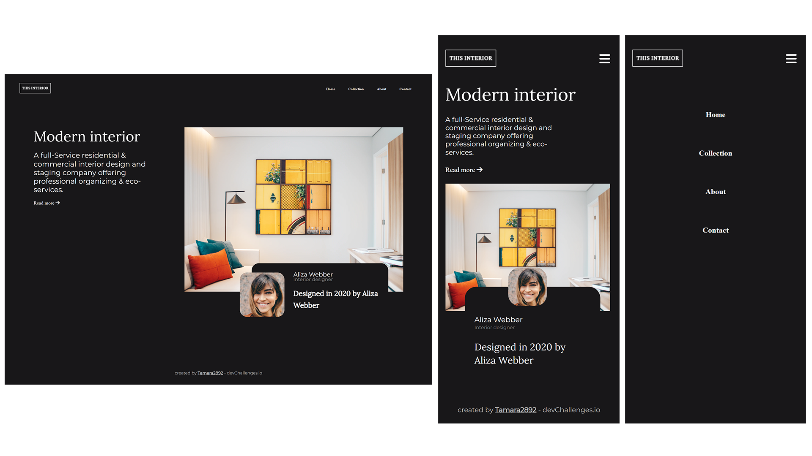

<!-- Please update value in the {}  -->

<h1 align="center">{Your project name}</h1>

   Solution for a challenge from  <a href="http://devchallenges.io" target="_blank">Devchallenges.io</a>.

  <h3>
    <a href="https://github.com/tamara2892/Consultora-de-interiores.git">
      Demo
    </a>
     | 
    <a href="https://consultora-de-interiores.netlify.app/">
      Solution
    </a>
     | 
    <a href="https://devchallenges.io/challenges/Jymh2b2FyebRTUljkNcb">
      Challenge
    </a>
  </h3>

<!-- TABLE OF CONTENTS -->

## Table of Contents

- Página web Responsive 
- [Contacto](https://github.com/tamara2892)

<!-- OVERVIEW -->

## Overview

Demo Página web Responsive de una consultora de interiores. Version Desktop y mobile.

### Built With

<!-- This section should list any major frameworks that you built your project using. Here are a few examples.-->

- [HTML](https://lenguajehtml.com/)
- [CSS](https://lenguajecss.com/)

## Features

<!-- List the features of your application or follow the template. Don't share the figma file here :) -->

This application/site was created as a submission to a [DevChallenges](https://devchallenges.io/challenges) challenge. The [challenge](https://devchallenges.io/challenges/Jymh2b2FyebRTUljkNcb) was to build an application to complete the given user stories.

## Contact

- GitHub [@tamara2892](https://{github.com/tamara2892})
